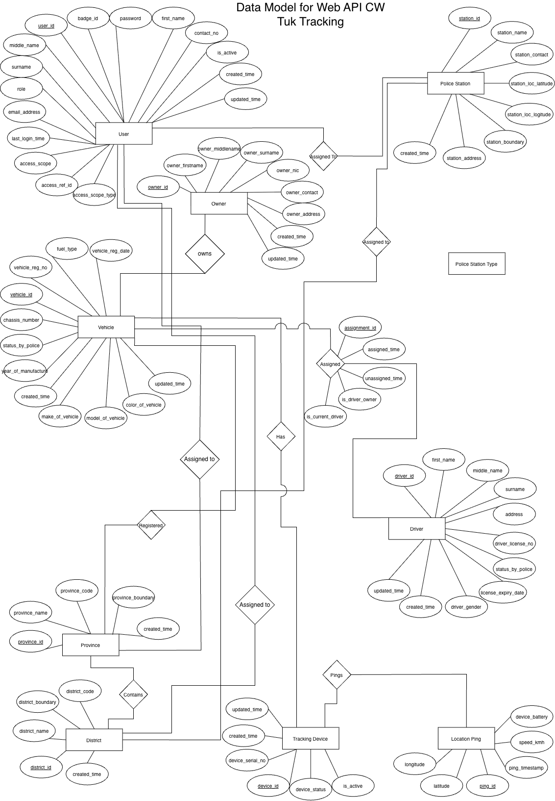

# tuktuk-tracking-backend-api
This repo is for my Web API Coursework related to Tuk-Tuk tracking (Three-wheel)

## Student Information

- **NIBM Student Index Number:** `COBSCCOMP242P-002`
- **Coventry Student ID:** `16114793`

---

## Project Overview
This project is a backend Web API developed as part of the NB6007CEM - Web API Development module.
The system is designed to support Sri Lanka Police and law enforcement agencies by providing a centralized platform for:

- Real-time tuk-tuk (three-wheeler) location tracking
- Vehicle visibility (last known location)
- Investigative logging (historical movement tracking)
- Administrative filtering (province and district level)

---

## Objectives
- Develop a secure, open-standard RESTful API
- Enable real-time and historical vehicle tracking
- Support law enforcement investigations
- Deploy a cloud-hosted backend system

---

## Key Features
- Vehicle management
- Driver and device management
- GPS location tracking
- Historical movement logs
- Role-based access control (Police HQ, Provincial, District)

---

## 🗂️ Data Model

  

*Figure: Entity Relationship Diagram for Tuk-Tuk Tracking System*

---

### 📖 Data Model Summary

The system is structured around several core entities that interact to support tracking, monitoring, and investigation workflows.

#### 🔑 Key Entities

- **User**  
  Represents system users such as police officers. Includes authentication details and role-based access control.

- **Police Station**  
  Stores station-related data such as name, contact number, and geographic boundaries.

- **Vehicle**  
  Contains tuk-tuk registration details, ownership information, and police status.

- **Driver**  
  Holds driver identity details, license information, address, and legal status.

- **Tracking Device**  
  Represents GPS devices installed in vehicles, including device status and serial numbers.

- **Location Details**  
  Stores GPS tracking data such as latitude, longitude, timestamp, and battery health.

- **Province**  
  Represents administrative regions with defined boundaries.

- **District**  
  Represents subdivisions within provinces for more granular administrative control.

---

#### 🔗 Relationships

- A **User** is assigned to a **Police Station**  
- A **Vehicle** is registered within a **Province** and **District**  
- A **Vehicle** is owned by a **Driver**  
- A **Vehicle** has a **Tracking Device**  
- A **Tracking Device** generates multiple **Location Details (pings)** over time  

---

#### 🚀 Purpose of the Data Model

This structure enables:

- Real-time tracking of tuk-tuks  
- Historical movement analysis for investigations  
- Efficient region-based filtering (Province/District)  
- Centralized data management for law enforcement  
